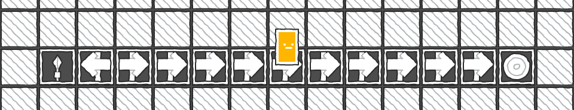

This repository includes simple implementations of classic RL algorithms, as well as a visual environment in which to run them. The implementations presented here are based on [Reinforcement Learning: An Introduction, Sutton and Barto, 2nd Edition](http://incompleteideas.net/book/RLbook2018.pdf.).

It also implements a cumulative reward visualizer with the help of the [easy charts](https://github.com/fenix-hub/godot-engine.easy-charts) Godot addon. Hold the space bar in an experiment to see a graph of the cumulative reward per episode. 

RL Sandbox can be played directly on your browser over on [itch](https://moraguma.itch.io/rl-sandbox)

### Implemented algorithms

- Dynamic Programming
- Adaptive Dynamic Programming
- Monte Carlo ES
- SARSA
- Q-learning
- LFA Q-learning