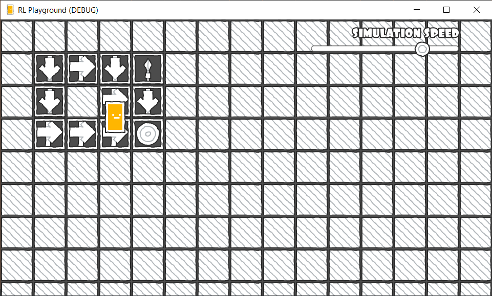

This repository includes simple implementations of classic RL algorithms, as well as a visual environment in which to run them. The implementations presented here are based on [Reinforcement Learning: An Introduction, Sutton and Barto, 2nd Edition](http://incompleteideas.net/book/RLbook2018.pdf.).

### Implemented algorithms

- Adaptive Dynamic Programming
- Monte Carlo ES